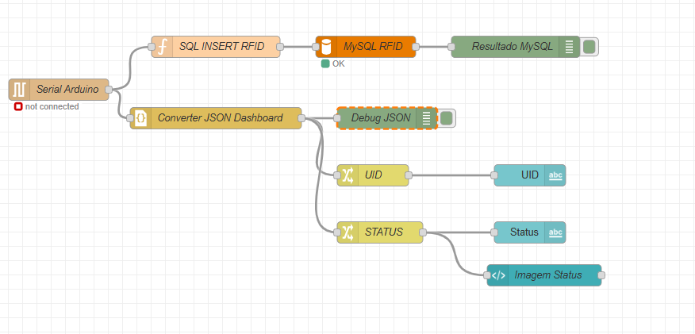

# Leitura de MFRC522 + Envio para NodeRed + Registro em banco MySql

Projeto de C++

# MySQL

Rodar servidor mysql e inserir o comando de database/DDL.sql

# Arduino

Inserir o código de main.ino

# Wokwi

Esquema do modelo:

https://wokwi.com/projects/460109016154382337

# NodeRed

- importar flows.json
- alterar porta do arduino conforme necessário
- alterar porta, user, senha e nome do banco conforme necessário

### Nós criados

### Dashboard

