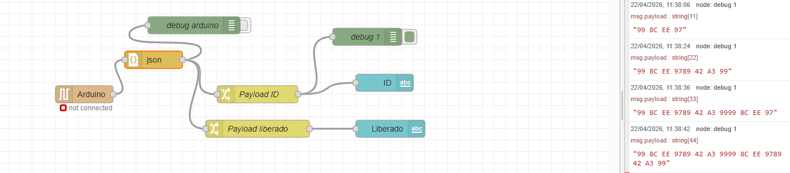
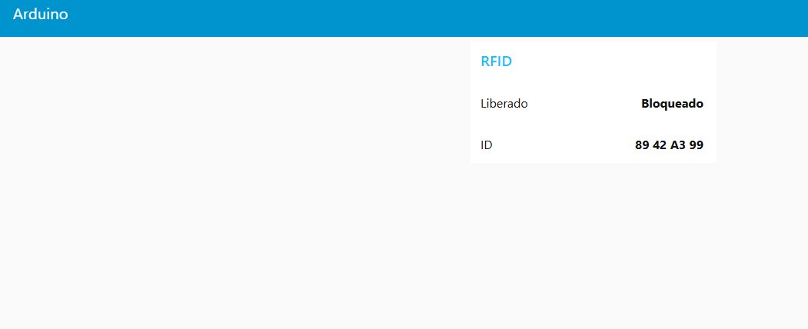

# Leitura de MFRC522 e envio para NodeRed por Serial em JSON
Projetos de C++

# NodeRed
importar flows.json
### Nós criados

### Dashboard

# Wokwi
Esquema do modelo:

https://wokwi.com/projects/460109016154382337